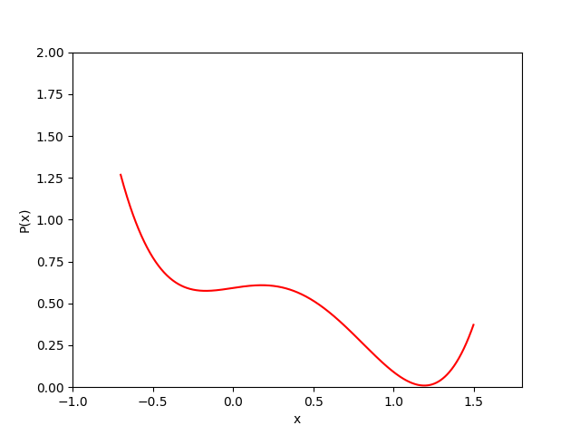

# Langevin Dynamics

This repo. implements Stochastic Gradient Langevin Dynamics (SGLD, _aka_ Langevin Dynamics) in PyTorch with autograd.

Conceptually, SGLD is a kind of Markov Chain Monte-Carlo (MCMC) method which we can use for sampling from the underlying distribution, no matter such distribution comes from the one with analytical form or the one defined by the trainable parametric model (_e.g._, a neural network).

Recently, Langevin Dynamics is usually used in Energy-based Model (EBM) and Generative Model when it needs to 
1) estimate the normalization constant of unnormalized function in EBM training
2) sample the synthesized data.

Note: well...actually Energy-based Model is also a popular approach for generative model

---------------------------------------------------------------------------
## Dependencies

* PyTorch
* tqdm
* opencv-python
* imageio
* matplotlib

the most important part is PyTorch, while the other ones are used for visualization in convenience


---------------------------------------------------------------------------
## Execution

simply run the python script `main.py`, and you will see the corresponding result `langevin_dynamics.gif` in the same root directory.

---------------------------------------------------------------------------
## Illustration

Here we define an easy case, $P(x) = \dfrac{\hat{P}(x)}{Z}$, where

(1) we only consider $x \in [-0.7, 1.5]$

(2) $\hat{P}(x) = (x-0.4)^4 - (x-0.2)^2 + 0.6$ (noting that it must be non-negative everywhere)

(3) $Z$ is normalization constant such that $\int_{-0.7}^{1.5} P(x) \,dx = 1$, thus $Z = \int_{-0.7}^{1.5} \hat{P}(x) \,dx \thickapprox 0.98887$, 

We can take a look at such defined probability density function as the following figure.



Then, we run `main.py` to see how we can use SGLD to sample from such $P(x)$, as shown in the following GIF.


As we can observe, the distribution of sampled points follows $P(x)$ exactly, revealing that the stationary state of our markov chain definitely reaches the desired pdf.

```
Note: 
We incrementally decrease the SGLD_step and corresponding noise scale to 
obtain an "annealed" SGLD chain, which can achieve a better result.
```

Hope this repo. can help you. :)